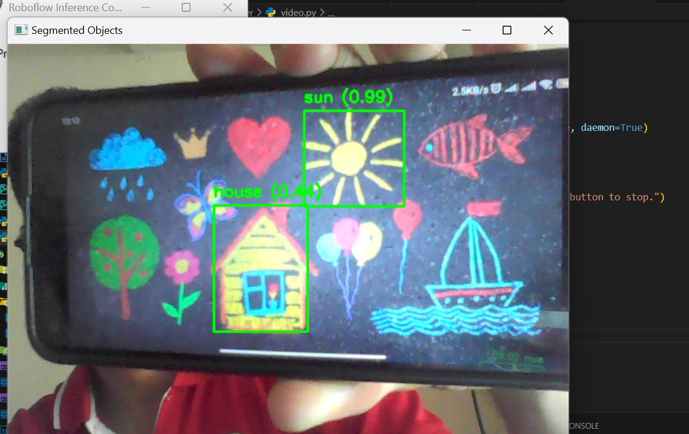

# Project VA KIDS DRAWINGS



Short overview

- Frontend: Vite + TypeScript (src/services/RoboflowService.ts) that calls Roboflow workflows or your backend.
- Backend: Flask API (server/app.py) and helper scripts (server/fruits.py, server/test.py) that use Roboflow inference SDK(s).

Repository files (visible)

- src/services/RoboflowService.ts — frontend service to call Roboflow serverless workflow.
- server/app.py — Flask server endpoint `/api/detect` (receives base64 images).
- server/fruits.py — local inference pipeline using `inference` package (video sink).
- server/test.py — quick test script calling a workflow.
- (Add any other project files you have in the project folder)

Quick setup (Windows)

1. Create and activate virtualenv

   ```powershell
   python -m venv .venv
   .\.venv\Scripts\Activate.ps1   # PowerShell
   # or .\.venv\Scripts\activate   # cmd
   ```

2. Install backend deps (recommended set)
   ```powershell
   pip install flask flask-cors python-dotenv pillow opencv-python numpy
   pip install inference roboflow-inference-sdk
   # Extras if you see ModelDependencyMissing warnings:
   pip install "inference[transformers]" "inference[sam]" "inference[clip]" "inference[gaze]" "inference[grounding-dino]" "inference[yolo-world]"
   ```

Environment (.env)

- Create `server/.env` or project `.env` with:
  ```
  ROBOFLOW_API_KEY=your_key_here
  ROBOFLOW_MODEL_ID=your_model_id_here
  ROBOFLOW_WORKSPACE=wisd-scixc
  ROBOFLOW_WORKFLOW=custom-workflow-5
  ```

Run the backend

```powershell
cd server
# activate venv if not active
python app.py
```

Test workflow (server/test.py)

- Ensure `apple.avif` (or another image) exists in server directory or use a valid image path.
- Run:

```powershell
python test.py
```

Common issues and fixes

- InferenceHTTPClient / SDK param mismatches:

  - Different SDK versions use different method names and parameters (infer, run_workflow, image_path, image, etc.). Prefer run_workflow for serverless workflows or check your installed SDK docs/version.
  - To inspect version: `pip show roboflow-inference-sdk` or `pip show inference`.

- ModelDependencyMissing:

  - Install the extras listed in the console for the missing model(s) (see install commands above).

- Async / coroutine warnings:

  - Make sink handlers `async def` and return a non-None value, or schedule them properly with `asyncio.create_task`.
  - Pass the coroutine function directly to the pipeline (avoid wrapping with a lambda that returns None).

- No predictions / unexpected result format:
  - Some pipeline results return SDK-specific objects (e.g., `Detections`) rather than plain dicts. Access attributes with getattr() or check for `.predictions` instead of using dict.get().

